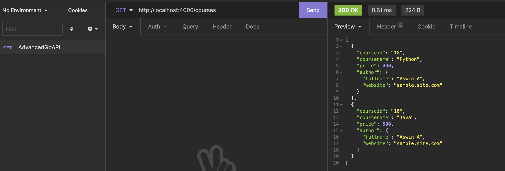
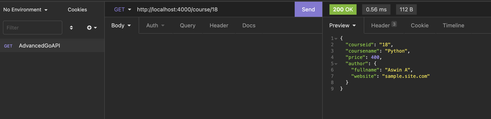
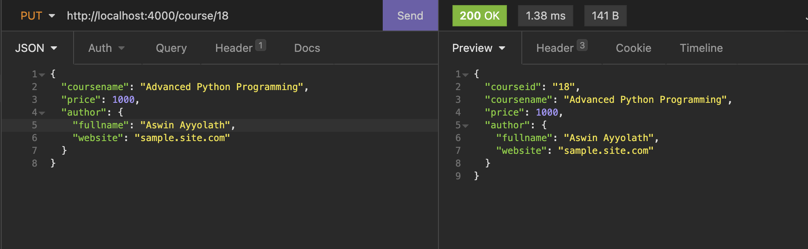
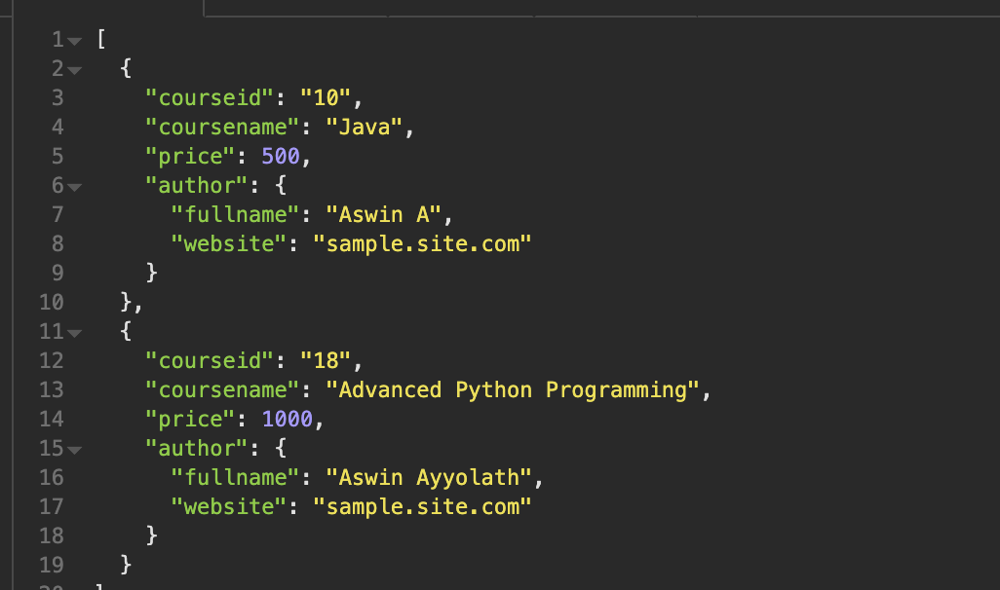
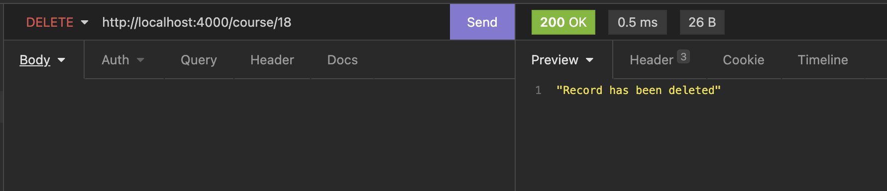
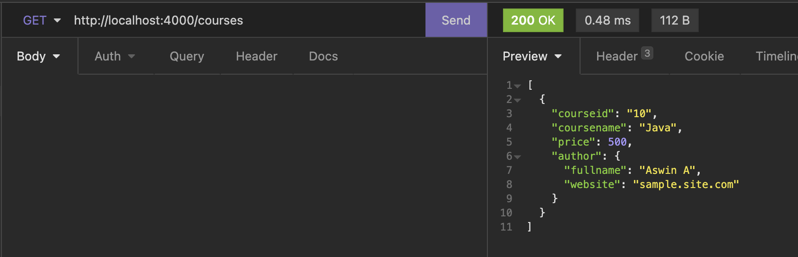

# Golang Advanced API with Gorilla Mux

This is a sample Go program demonstrating the usage of the [gorilla/mux](https://github.com/gorilla/mux) package for handling routing in a Golang API. Please note that this code is intended for educational purposes and is not a fully functional implementation in terms of validations, checks, or complete CRUD functionality.

## Getting Started

### Prerequisites

Make sure you have Go installed on your machine. If not, you can download it from [here](https://golang.org/dl/).

### Installing gorilla/mux

To run this program, you need to install the `gorilla/mux` package. Open a terminal and run the following command:

```bash
go get -u github.com/gorilla/mux
```

This will download and install the package in your Go workspace.

### Running the Program

#### Clone this repository:

```bash
git clone <repository_url>
```

#### Change into the project directory:

```bash
cd <project_directory>
```

#### Run the Go program:

```bash
go run main.go
```

The API server will start running on **`http://localhost:4000/`**

### Sample API Calls

#### POST


### GET (All)



### GET (By Id)



### PUT




### DELETE




## About gorilla/mux

Gorilla Mux is a powerful URL router and dispatcher for Go. It provides features like request variables, matching based on HTTP methods, and a simple and expressive way to define routes.

### Key features include

- **Route Variables**: Extract variables from the request URL.
- **Route Patterns**: Use flexible and powerful route patterns to define your API endpoints.
- **Middleware**: Attach middleware to your routes for additional functionality.
- **Subrouters**: Create modular and reusable routers for different parts of your application.
For more information and examples, refer to the gorilla/mux [documentation](https://github.com/gorilla/mux)
